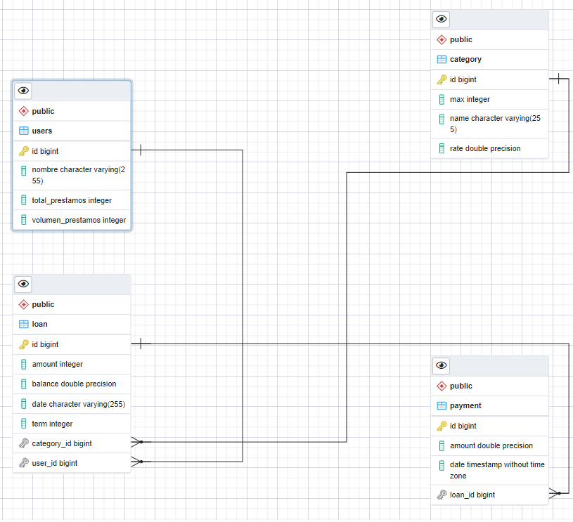
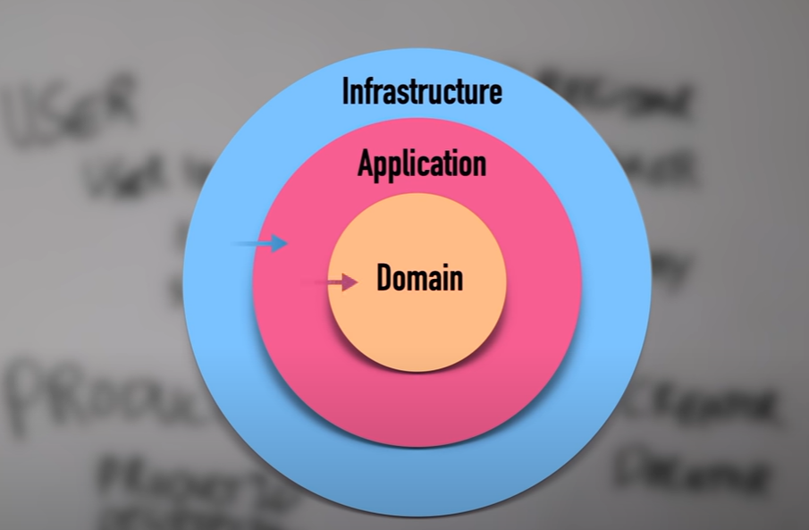

# RETO TECNICO BACKEND - JAVA

## Antes de Iniciar

El proyecto se desarrollo usado arquitectura hexagonal ("quien eres que tipo"), se compone de 4 casos de uso cada uno con su respectiva carpeta de dominio, application e infraestructura desplegado en AWS a traves de un EC2.

Github del proyecto [github](https://github.com/Jimenez-Omar/challenge_meli)

# MODELADO DE BASE DE DATOS

## Category

Este caso de uso se encarga de controlar la creacion, actualizacion y listado de los targes a traves de los siguientes end-points:

#### * /category/new: permite crear un target o categoria
#### METHOD: POST
#### BODY => {
    "name": "PREMIUM",
    "rate": 0.05,
    "max": 5000000
}
#### * /category/update/id_target: permite actualizar una categoria o target en base al id de la misma
#### METHOD: POST
#### BODY =>    {
        "name": "NEW",
        "rate": 0.20,
        "max": 500000
    }
#### * /category/list: permite listar todas las categorias o targets creados
#### METHOD: GET
#### BODY => No Aplica

## Loans

Este caso de uso se encarga de la creacion de prestamos asi como de sus respectivas operacion de logica de negocio y expone los siguientes end-points:

#### * /loan/new: Permite crear un nuevo prestamo asociado a un usuario en particular
#### METHOD: POST
#### BODY => {
    "amount":480000,
    "term":12,
    "user_id":8
}
#### * /loan/debt/id_prestamo: Permite Obtener lista de prestamos por id de usuario
* #### METHOD: POST
#### BODY => No Aplica

#### * /user/between/id_uduario: Permite Obtener lista de prestamos entre rango de fechas y por id de usuario
#### METHOD: POST
#### BODY => {
    "from":"2022-08-17 23:43:06",
    "to":"2022-08-17 23:45:41"
}
## Payment

Este caso de uso se encarga de la creacion de pagos asociados a un prestamo en particular y lo hace a traves de un unico end-point.
#### METHOD: POST
* /payment/new/id_prestamo: Permite crear un pago asociado a un prestamo
#### METHOD: POST
#### BODY => { 
    "amount":49000 
}

### Users
Este caso de uso se encarga de controlar la visualizacion de los usuarios del sistema

#### * /user/list: Lista todos los usuarios del sistema

#### METHOD: POST
#### BODY => No Aplica

## CLEAN ARCHITECTURE 

Este proyecto se creo usando arquitectura limpia siguiendo el patron de diseño de arquitectura hexagonal

Para entender el porque decidi usar este patron, puede remitirse al siguiente video: [youtube](https://www.youtube.com/watch?v=y3MWfPDmVqo)
